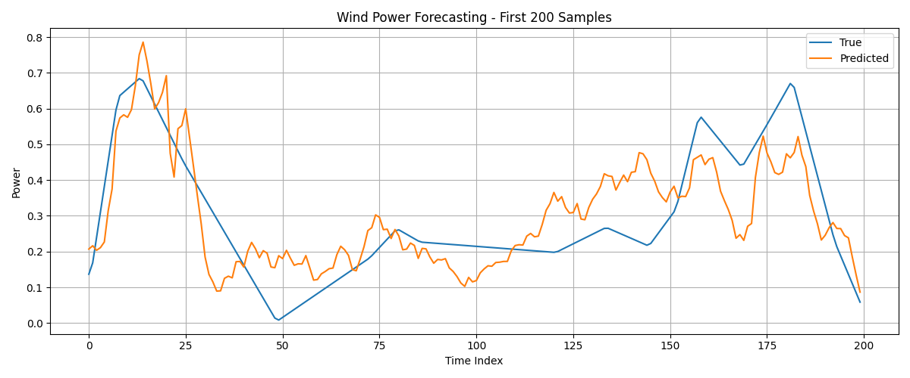
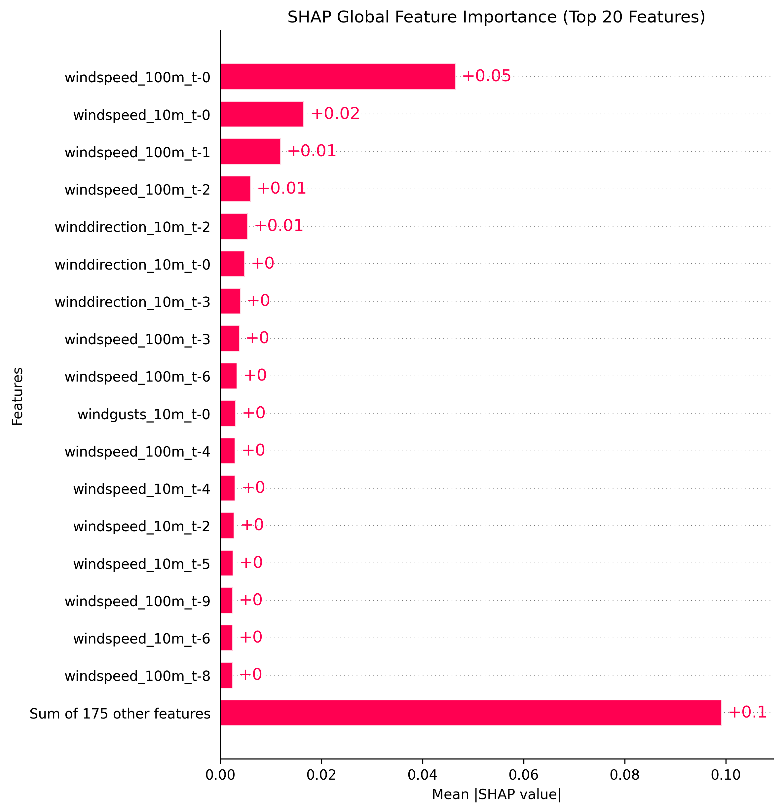
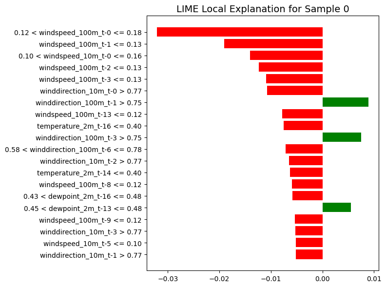

# Explainable Wind Power Forecasting with Deep Learning

This repository contains a reproducible research artifact for short-term wind power forecasting using deep learning and explainable AI. The project compares Temporal Convolutional Network (TCN), LSTM, GRU, CNN-LSTM, and Transformer models for one-hour-ahead wind power prediction, then applies SHAP and LIME to interpret the TCN forecasts.

This work was completed as part of my master's-level computer science research portfolio. The research was presented at the BIM 2025 conference and is currently in the process of being published as a Taylor & Francis book chapter.

## Research Questions

The associated manuscript studies the following questions:

| ID | Research question |
| --- | --- |
| RQ1 | How do TCNs compare to recurrent and hybrid deep learning models for short-term wind power forecasting? |
| RQ2 | Which explainable AI methods provide meaningful insight into TCN-based wind power predictions? |
| RQ3 | What trade-off emerges between forecasting accuracy, model complexity, and interpretability when combining TCNs with SHAP and LIME? |

## Dataset

The experiment uses `data/raw/Location1.csv`, corresponding to Location 1 from the Kaggle dataset [Wind Power Generation Data - Forecasting](https://www.kaggle.com/datasets/mubashirrahim/wind-power-generation-data-forecasting/data?select=Location1.csv), uploaded by Mubashir Rahim.

| Property | Value |
| --- | --- |
| Source | Kaggle: Wind Power Generation Data - Forecasting |
| License | CC0: Public Domain, according to the Kaggle dataset page |
| File used | `Location1.csv` |
| Rows | 43,800 hourly observations |
| Time range | 2017-01-02 00:00:00 to 2021-12-31 23:00:00 |
| Target | `Power`, normalized wind power output |
| Input features | temperature, relative humidity, dew point, wind speed, wind direction, and wind gust measurements |

The repository stores the raw CSV needed to reproduce the scripts. Generated arrays, trained models, figures, and local manuscript files are excluded from version control and are written to `artifacts/` when the workflow is run.

## Experimental Settings

| Setting | Repository implementation |
| --- | --- |
| Forecast horizon | One hour ahead |
| Sliding window | 24 previous hourly observations |
| Feature count | 8 meteorological variables |
| Split | Chronological 80/20 train-test split, no shuffling |
| Scaling | MinMax scaling on input features |
| Loss | Mean squared error |
| Optimizer | Adam, learning rate 0.001 |
| Epochs | 15 |
| Batch size | 32 |
| Validation split | 0.1 from the training partition |
| Random seed | 42 in TensorFlow/Keras and NumPy where stochastic training or explanations are used |

Note: the submitted manuscript discusses the broader TCN-XAI study and includes 48-hour-window experiments from the paper preparation process. This public repository preserves the cleaned, runnable code snapshot currently available in this folder.

## Why TCN For SHAP/LIME?

The TCN model was selected as the main explainability target because it is the proposed architecture in the manuscript and provides a strong accuracy-efficiency trade-off for time-series forecasting. Its causal and dilated convolutions capture recent and longer-range temporal patterns without recurrent layers, making training and inference more parallelizable than LSTM/GRU-style models.

In the saved repository results, the TCN achieved the strongest MAE among the main baselines. SHAP and LIME were then applied to the TCN to inspect whether the model's predictions were driven by physically meaningful wind features rather than opaque correlations.

## Results

Full summarized metrics are available in `results/metrics_summary.csv`.

| Rank | Model | MAE | RMSE | Notes |
| ---: | --- | ---: | ---: | --- |
| 1 | TCN, 15 epochs | 0.1195 | 0.1595 | Best MAE among saved baseline runs |
| 2 | LSTM | 0.1207 | 0.1567 | Best RMSE among saved baseline runs |
| 3 | CNN-LSTM | 0.1212 | 0.1596 | Competitive hybrid baseline |
| 4 | GRU | 0.1293 | 0.1661 | Recurrent baseline |
| 5 | Transformer | 0.1754 | 0.2226 | Underperformed on this setup |

The SHAP and LIME analyses both indicate that recent wind speed at 100 meters is one of the most influential predictors for wind power output. In the saved SHAP summary, `windspeed_100m_t-0`, `windspeed_10m_t-0`, and recent lagged `windspeed_100m` values are the top contributors.

## Result Figures

### TCN Forecast vs. Actual Power



### SHAP Global Feature Importance



### LIME Local Explanation



## Repository Structure

```text
.
|-- data/raw/Location1.csv
|-- docs/
|   |-- methodology.md
|   `-- results_summary.md
|-- results/
|   |-- figures/
|   `-- metrics_summary.csv
|-- scripts/
|   |-- run_full_workflow.py
|   |-- preprocessing.py
|   |-- train_tcn.py
|   |-- train_lstm_baseline.py
|   |-- train_gru_baseline.py
|   |-- train_cnn_lstm_baseline.py
|   |-- train_transformer_baseline.py
|   |-- shap_explain_tcn.py
|   |-- lime_explain_tcn.py
|   `-- evaluate_xai.py
`-- requirements.txt
```

## Setup

```powershell
python -m venv .venv
.\.venv\Scripts\activate
pip install -r requirements.txt
```

## Reproduce The Full Workflow

After activating the environment, run the full pipeline with one command:

```powershell
python scripts/run_full_workflow.py
```

This runs preprocessing, trains all baseline models, generates SHAP and LIME explanations for the TCN model, and writes generated files to `artifacts/`.

Individual steps can also be run separately:

```powershell
python scripts/preprocessing.py
python scripts/train_tcn.py
python scripts/shap_explain_tcn.py
python scripts/lime_explain_tcn.py
python scripts/evaluate_xai.py
```

## Associated Manuscript

This repository accompanies a research manuscript on wind power forecasting using deep learning models and explainable AI methods. The research was presented at the BIM 2025 conference and is currently in the process of being published as a book chapter by Taylor & Francis. The manuscript is not included in this public repository while publication is pending.

A formal citation and manuscript link will be added after publication.

## Citation

If you use this repository before the book chapter is published, please cite it as an unpublished research artifact and cite the final Taylor & Francis chapter once available.

```bibtex
@incollection{fuad_tcn_xai_wind_forecasting_forthcoming,
  author    = {Fuad, Khondaker Zahin and Ahmed, Firoz},
  title     = {TCN-XAI: An Explainable Framework for Short-Term Wind Forecasting Using Dilated Temporal Convolutional Networks},
  booktitle = {Forthcoming Taylor & Francis book chapter},
  publisher = {Taylor & Francis},
  year      = {forthcoming},
  note      = {Presented at BIM 2025}
}
```
